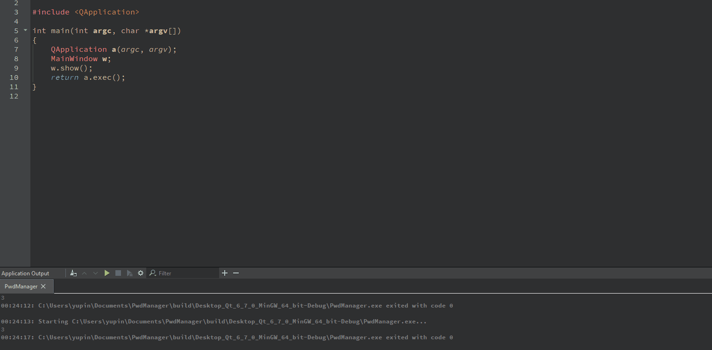

# Password Manager
This was made as a Personal Project for learning Qt.

## Learning Objectives
- Navigate Qt IDE
- Create a working UI
- Understand the different parts of Qt

## Things I still need clarity on 
- Connecting signals to custom functions

n.b., Terribly insecure so don't try to use it.
